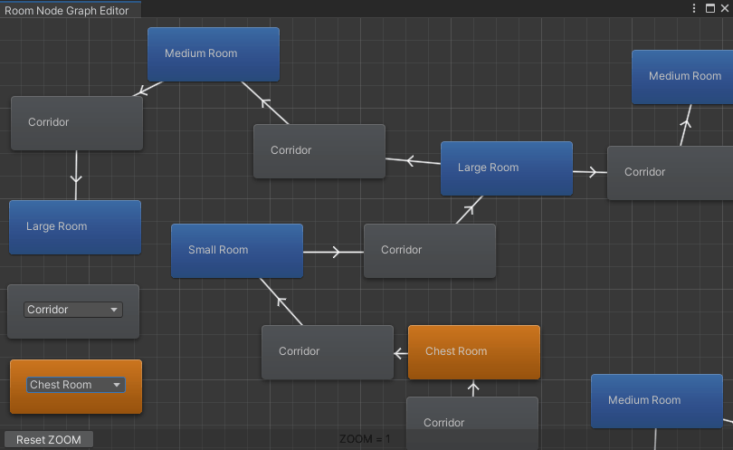
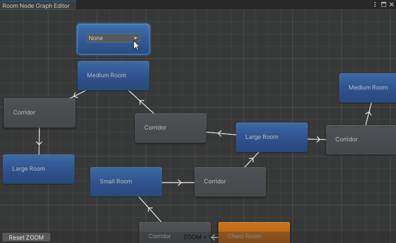

# DungeonRoomEditorZoom

Add a zoom functionnality in the dungeon editor graph for the project https://www.udemy.com/course/unity-2d-dungeon-gunner-roguelike-development-course/ using this page http://martinecker.com/martincodes/unity-editor-window-zooming/.
_Note: This project use Unity 2021.1.7f1._

You will find here only the files to change, not everything, ie __RoomNodeSO.cs__ and __RoomNodeGraphEditor.cs.

__WARNING:__

There is bug with the popup window position when zooming. I think it's related to this bug: https://issuetracker.unity3d.com/issues/editor-gui-editorgui-dot-popups-selectable-region-is-incorrectly-scaled-slash-re-positioned-when-using-gui-dot-matrix

